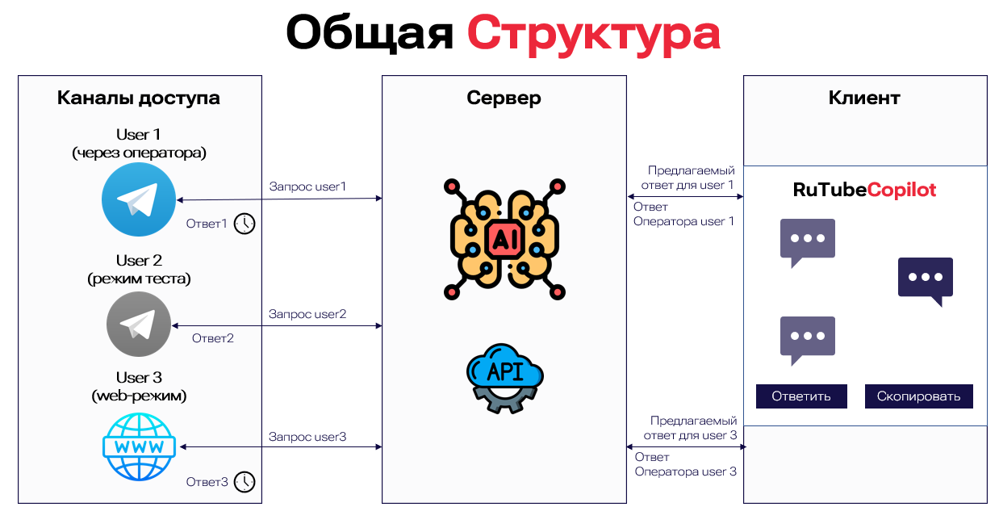

# hackrutu

**RUTUBECopilot** - Интеллектуальный помощник оператора службы поддержки
Описания проектов находятся в корне папок, в проектах, в файлах Readme.md.

**[ml](https://github.com/ilya-edu/hackrutu/tree/master/ml)** - описание модуля ML (данные, модели, обучение) 
**[backend](https://github.com/ilya-edu/hackrutu/tree/master/backend)** - бэкенд системы (подробным описание в readme) 
**[tgbot](https://github.com/ilya-edu/hackrutu/tree/master/tgbot)** - Telegram-бот для общения пользователя с оператором тех.поддержки 

## Ссылки на демо

Telegram-бот для вопросов от пользователей, может работать в режиме пользователя и тестовом режиме оператора
https://t.me/rutube_hack_bot 

Web-админка для оператора поддержки (можно войти через режим гостя или выйти из гостевого режима, он по умолчанию и зайти в качестве оператора поддержки login:manager pass:zak2)  
https://rutube-copilot-api.kovalev.team 

## Структура системы

## Пример работы системы можете посмотреть по ссылке