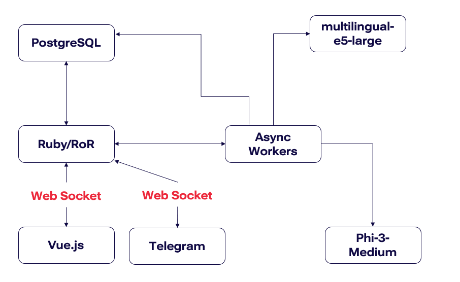

# backend

### архитектура решения


### Запуск
```bash
docker-compose down && docker-compose up --build
```

### Подготовка Данных
1. запустите приложение командой выше и откройте [localhost:3035/articles/new]()
2. Загрузите в форму файл с статьями который лежит в репо  lib/merged_output.csv
3. Откройте админку и можете видеть что создаются статьи http://localhost:3035/admin/article
4. Проверте что работает базовый RAG http://localhost:3035/articles
5. Тут можно создать конфиг задать промпты и указать адресс LLM http://localhost:3035/admin/config
   
### Прозрачность данных
В файле app/jobs/llm_job.rb находится job который подготваливает ответ для пользователя.

В файле models/llm происходит запрос на LLM

В файле models/semantic_search.rb происходит поиск контекста в базе данных

На странице https://rutube-copilot-api.kovalev.team/admin/message можно видеть список всех сообщенией 
в системе и если зайти в какое-нибудь сообщение можно увидеть контекст, который был отправлен в LLM и референсы на статьи, из которых взят контекст

### Основные пути
- [Чатбот](https://rutube-copilot.kovalev.team) можно зайти под гостем или под админом `manager:zak2`
- [Админка](https://rutube-copilot-api.kovalev.team/admin)
- [Поиск по корпусу статей](https://rutube-copilot-api.kovalev.team/articles)
- [Загрузка статей](https://rutube-copilot-api.kovalev.team/articles/new)

