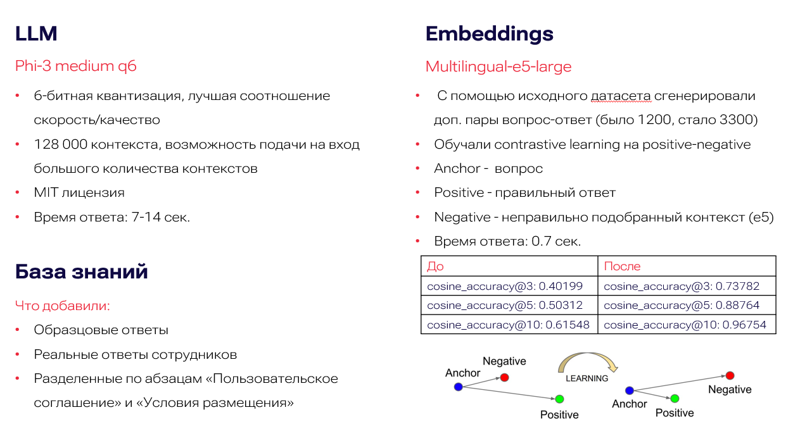

# ML

В качестве мы взяли Phi3-Medium 6-битная квантизацию, с помощью подбора мы нашли лучшую соотношение скорость/качество. Она имеет лицензию MIT, значит ее можно использовать в том числе коммерческих целях
В базу знаний мы добавили образцовые ответы, реальные ответы сотрудников и разделенные по абзацам документации, а также сгенерированные ответы
Finetuned e5-large с помощью констрактивного обучения, негативы подбирали с помощью e5, брали топ 10 контекстов, правильный относили к positive, а остальные 9 к negotive.  https://huggingface.co/dankalin/multilingual-e5-large-hack

Метрики представлены ниже.

## Технические детали ML

Косинусная точность измеряет, насколько часто косинусное сходство между anchor и positive примерами больше, чем между anchor и negative примерами.
Формула:
Обычно рассчитывается как процент случаев, когда cos(anchor, positive) > cos(anchor, negative).
В контексте RAG, высокая косинусная точность указывает на то, что энкодер хорошо отличает релевантные документы от нерелевантных.Помогает понять, насколько хорошо модель различает семантически близкие и далекие примеры.
